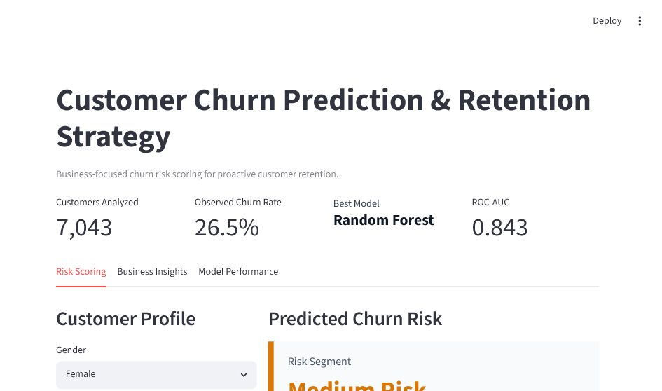
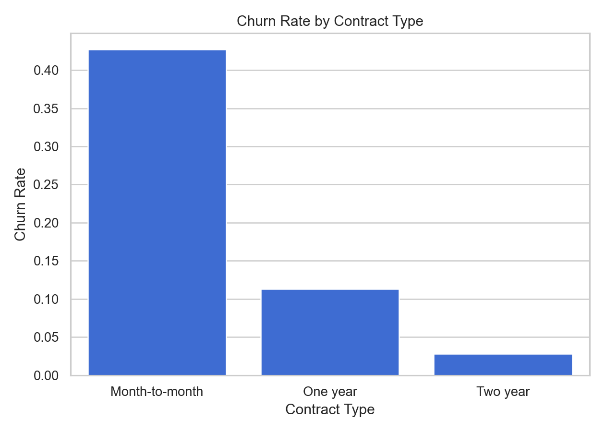
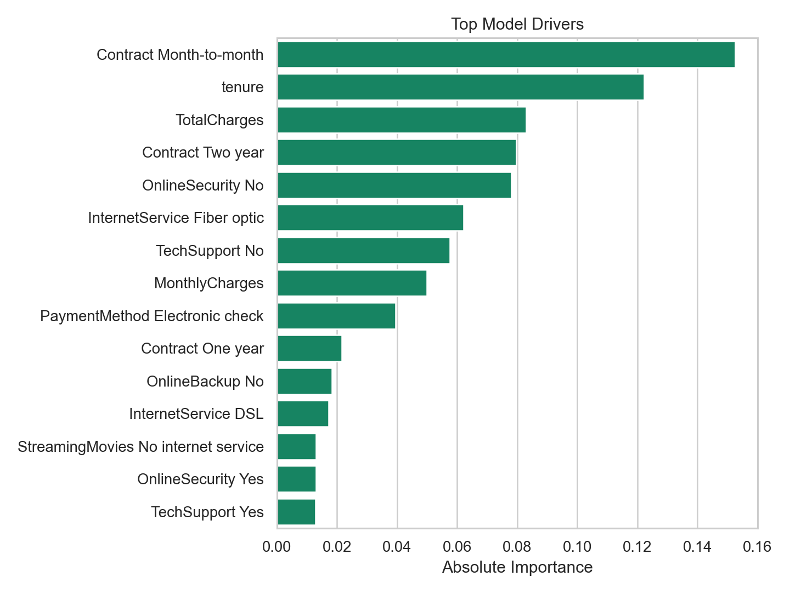

# Customer Churn Prediction & Retention Strategy

Portfolio-grade machine learning project for predicting telecom customer churn and translating model output into retention actions.

GitHub repository name: `customer-churn-prediction-and-retention-strategy`.

## Business Problem

Customer churn creates recurring revenue loss and increases acquisition pressure. The objective of this project is to identify customers most likely to leave so the business can intervene before churn happens.

This project answers:

- Which customer profiles are most likely to churn?
- Which model best separates churners from retained customers?
- Which customers should receive retention outreach first?
- What business actions should be taken based on predicted risk?

## Dataset

Source: IBM Telco Customer Churn dataset.

The dataset contains 7,043 customers with demographic, account, service, billing, and churn outcome fields.

Target variable: `Churn`

Key feature groups:

- Customer profile: gender, senior citizen status, partner, dependents
- Account behavior: tenure, contract type, paperless billing, payment method
- Services: internet service, phone service, support, streaming, protection
- Revenue: monthly charges, total charges

## Project Workflow

1. Business problem framing
2. Data cleaning
3. Exploratory analysis
4. Feature engineering and encoding
5. Model training
6. Model comparison
7. Model evaluation
8. Business interpretation
9. Retention recommendations
10. Streamlit dashboard deployment

The exploratory notebook is available at `notebooks/01_eda_and_business_insights.ipynb`.

## Models Compared

- Logistic Regression
- Decision Tree
- Random Forest

The final model was selected using ROC-AUC, with recall and F1 considered because churn detection is an intervention problem: missing a likely churner can be more expensive than flagging a customer for review.

## Results

| Model | Accuracy | Precision | Recall | F1 | ROC-AUC |
|---|---:|---:|---:|---:|---:|
| Random Forest | 0.7544 | 0.5251 | 0.7834 | 0.6288 | 0.8430 |
| Logistic Regression | 0.7381 | 0.5043 | 0.7834 | 0.6136 | 0.8416 |
| Decision Tree | 0.7544 | 0.5260 | 0.7567 | 0.6206 | 0.8318 |

Best model: Random Forest

## Business Insights

- Overall churn rate: 26.5%
- Month-to-month customers churn at 42.7%
- Electronic check customers churn at 45.3%
- Fiber optic customers churn at 41.9%
- Observed monthly revenue associated with churned customers: $139,130.85

## Dashboard

The Streamlit app allows a user to:

- Enter a customer profile
- Generate a churn probability
- Assign the customer to a risk segment
- View recommended retention actions
- Compare model performance
- Review churn drivers and business insights

Dashboard screenshot:



## Key Visuals





## How To Run

Create and activate a virtual environment, then install dependencies:

```bash
pip install -r requirements.txt
```

Train the model and generate reports:

```bash
python src/train_model.py
```

Run the dashboard:

```bash
streamlit run app/streamlit_app.py
```

## Project Structure

```text
.
├── app/
│   └── streamlit_app.py
├── data/
│   ├── raw/
│   └── processed/
├── models/
│   └── churn_model.joblib
├── notebooks/
│   └── 01_eda_and_business_insights.ipynb
├── reports/
│   ├── figures/
│   ├── business_summary.json
│   ├── feature_importance.csv
│   └── model_metrics.json
├── src/
│   └── train_model.py
├── requirements.txt
└── README.md
```

## Business Recommendations

- Prioritize month-to-month customers for upgrade incentives.
- Build early-life retention workflows for customers with low tenure.
- Investigate electronic check customers for payment friction and billing dissatisfaction.
- Bundle technical support into retention offers for high-risk customers without support.
- Use churn probability as a prioritization signal, not as an automated decision system.

## Limitations

- The dataset is historical and does not include customer interaction notes, complaint history, usage trends, competitor pricing, or campaign exposure.
- Model output should be combined with business rules and customer lifetime value before actioning retention spend.
- The model predicts churn probability, not the exact reason a customer will leave.
